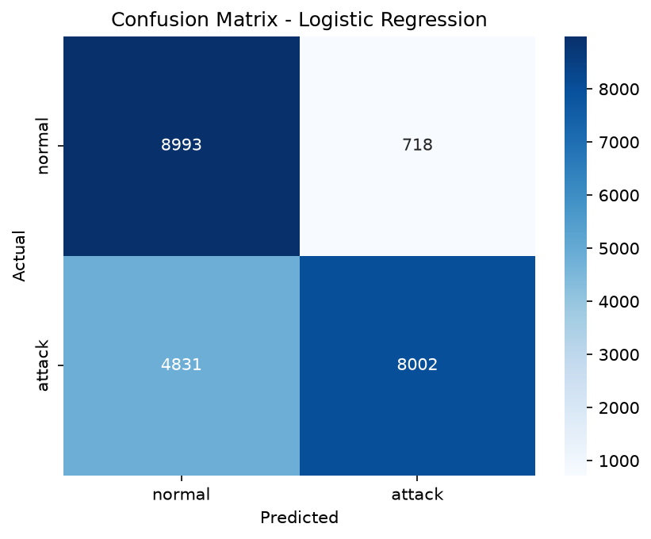
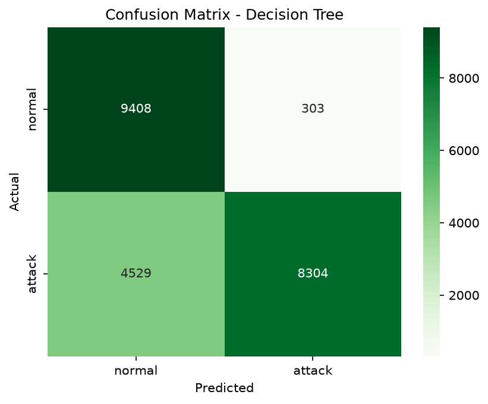
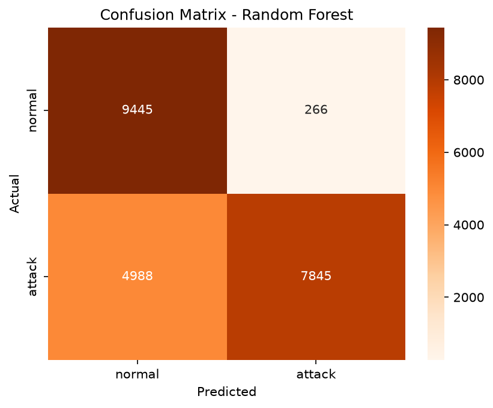
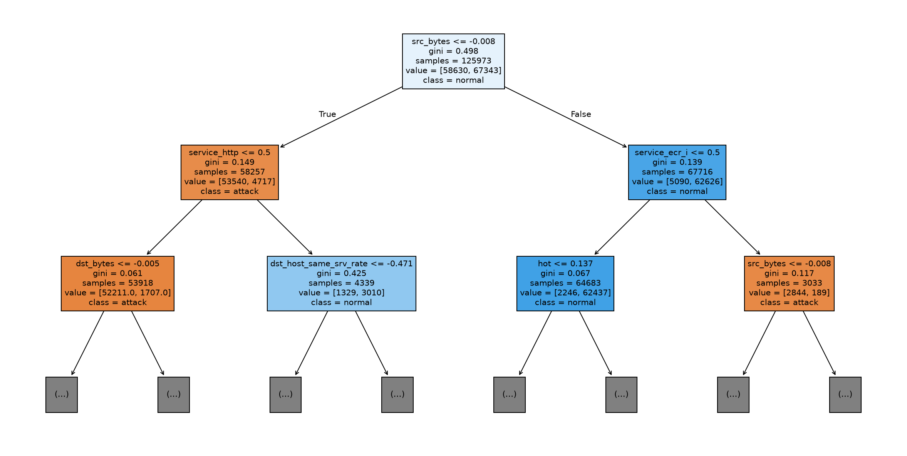
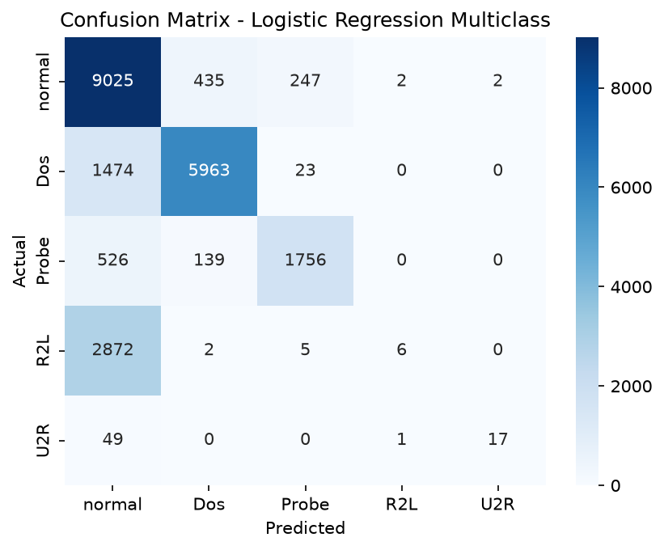

## 📓 Progress Log

### ✅ Section 1: Data Loading & Exploration
- Loaded train/test files with proper column names (raw files have no headers)
- Confirmed shapes match expected: `train (125973, 43)`, `test (22544, 43)`
- Checked class balance on the `label` column:

  | Class | Count | % |
  |---|---|---|
  | 🟢 `normal` | 67,343 | ~53% |
  | 🔴 attacks (combined, 22 types) | ~58,630 | ~47% |

  - Binary split is **well-balanced** ✅
  - Individual attack types are **severely imbalanced** ⚠️ (`neptune` = 41,214 rows vs `spy` = 2 rows)
  - → This is why the project starts with **binary classification** before extending to multi-class

- 🧹 Noted: the `difficulty` column is metadata about historical classification difficulty — **not a real feature**, excluded from model training

### ✅ Section 2: Binary Label Creation
- Created a new `binary_label` column collapsing all 22 specific attack types into a single `attack` category, alongside `normal`
- Train set: 67,343 normal / 58,630 attack (~53/47 split)
- Test set: 9,711 normal / 12,833 attack (~43/57 split) — **majority flipped compared to train**
- 🔑 Key finding: NSL-KDD's test set deliberately includes attack patterns not seen in training, to test generalization rather than memorization — a harder, more realistic evaluation than train/test sets with matching distributions

### ✅ Section 3: Preprocessing
- Verified categorical columns (`protocol_type`, `service`, `flag`) using `.unique()`: 3 / 70 / 11 distinct values respectively
- One-hot encoded categorical columns using `OneHotEncoder(handle_unknown="ignore")`, fit on train only, applied to both train and test — 84 new columns total
- Verified numeric columns via `.dtypes` before scaling, rather than assuming
- Scaled 38 numeric columns using `StandardScaler`, fit on train only, applied to both train and test
- Merged scaled numeric + encoded categorical + binary label into one final table using `pd.concat(axis=1)`
- Final shapes: `train_final (125973, 123)`, `test_final (22544, 123)`
- 🔑 Key principle applied throughout: **fit only on train, transform both train and test** — prevents data leakage from test into how features are encoded/scaled

- 💾 Saved final processed data to `data/processed_train.csv` and `data/processed_test.csv` for use in the modeling notebook (kept preprocessing and modeling as separate notebooks for clarity)

### ✅ Section 4a: Logistic Regression (baseline)
- Trained `LogisticRegression(max_iter=1000)` on 122 features, 125,973 training rows
- Test set results:

  | Metric | Attack | Normal |
  |---|---|---|
  | Precision | 0.92 | 0.65 |
  | Recall | 0.62 | 0.93 |
  | F1-score | 0.74 | 0.76 |

  Overall accuracy: 75%

- 🔑 Key finding: high precision but low recall on the attack class means the model is **cautious about false alarms but misses real threats** — confusion matrix shows 4,831 real attacks (out of 12,833) were misclassified as normal, a 37.6% miss rate
- In a security context, this kind of false negative (missed attack) is more dangerous than a false positive (false alarm) — this is the gap I want Decision Tree and Random Forest to close
- Possible optimizations identified (not yet applied): adjusting decision threshold, `class_weight="balanced"`, tuning regularization (`C`), or trying non-linear models




### ✅ Section 4b: Decision Tree
- Trained `DecisionTreeClassifier(random_state=42)` on the same 122 features
- Test set results:

  | Metric | Attack | Normal |
  |---|---|---|
  | Precision | 0.96 | 0.68 |
  | Recall | 0.65 | 0.97 |
  | F1-score | 0.77 | 0.80 |

  Overall accuracy: 79%

- 🔑 Key finding: improved over Logistic Regression on every metric, but recall on attack class (0.65) is only a modest gain over LogReg's 0.62 — still missing roughly a third of real attacks. Suggests the imbalance itself may be a bigger driver of this pattern than model architecture alone.



### ✅ Section 4c: Random Forest
- Trained `RandomForestClassifier(random_state=42)` (100 trees, default settings)
- Test set results:

  | Metric | Attack | Normal |
  |---|---|---|
  | Precision | 0.97 | 0.65 |
  | Recall | 0.61 | 0.97 |
  | F1-score | 0.75 | 0.78 |

  Overall accuracy: 77%



### 📊 Three-Model Comparison

| Model | Attack Precision | Attack Recall | Attack F1 | Accuracy | Attacks Missed |
|---|---|---|---|---|---|
| Logistic Regression | 0.92 | 0.62 | 0.74 | 75% | 4,831 / 12,833 |
| Decision Tree | 0.96 | **0.65** | **0.77** | **79%** | **4,529 / 12,833** |
| Random Forest | **0.97** | 0.61 | 0.75 | 77% | 4,988 / 12,833 |

🔑 **Key finding:** Decision Tree outperformed untuned Random Forest on recall, F1, and accuracy — counter to the common assumption that ensembles always beat single trees. Likely explanation: Random Forest's advantage depends heavily on tuning (number of trees, depth, feature sampling); with default settings, it didn't clearly outperform a single well-fit tree here. This is a strong candidate for hyperparameter tuning as a next step.

⚠️ **Debugging note:** initially pulled a mismatched confusion matrix (from a stale/incorrect prediction variable after a kernel restart) that gave inconsistent numbers versus the classification report. Caught by cross-checking recall/accuracy calculated from the confusion matrix against the reported metrics — they didn't match, which flagged the error before it got recorded incorrectly.

### ✅ Section 5: Interpretability

**Logistic Regression coefficients:**
- Checked top features pushing toward attack/normal
- Found two issues with trusting raw coefficients blindly:
  - `flag_S0` looked weak/backwards in the coefficients, but real data showed it's 99% attack when present — likely explained by correlated features "absorbing" its credit
  - `num_compromised` had the single strongest coefficient, but 99% of rows share the same value — likely an unstable coefficient learned from very few varying examples
- 🔑 Lesson: individual coefficients can mislead when features are correlated or rarely vary — always cross-check against real data before trusting a "top feature" list

**Decision Tree visualization (first 2 levels):**
- Root split: `src_bytes <= -0.008` (very low data sent) — most powerful single split across all 122 features
- Left branch (low src_bytes, not http) → strongly attack-leaning (gini 0.149)
- Right branch (normal/higher src_bytes) → strongly normal-leaning
- Matches domain knowledge from Section 1: many attacks send little/no data (connection never completes)

**Random Forest feature importance (top 15):**
- Top feature: `src_bytes` (0.169) — agrees with Decision Tree's top split, two independent methods confirming the same finding
- `flag_S0` ranks 14th (0.023) — real but diluted by correlated features
- New finding: `logged_in` ranks 6th (0.052) — makes sense, many attacks never complete authentication
- 🔑 Overall pattern: model relies mainly on traffic volume, service-behavior consistency, and login status — a sensible, explainable set of signals, not black-box noise



### ✅ Section 6: Hyperparameter Tuning (Random Forest)

- Used `GridSearchCV` to test combinations of `n_estimators` [100, 200], `max_depth` [None, 10, 20], `class_weight` ["balanced"]
- 30 models trained total (6 combinations × 5-fold cross-validation)
- Best combination found: `n_estimators=200, max_depth=None, class_weight="balanced"`
- Cross-validation score during search: **99.9% accuracy** — but this was measured only on training data splits

**⚠️ Important finding: the 99.9% score was misleading.**
- When tested on the real, held-out test set, accuracy dropped to **78%**
- This is a textbook example of **overfitting** — the model performed almost perfectly on data resembling what it trained on, but much worse on genuinely new patterns
- Directly connects back to Section 2's finding: NSL-KDD's test set deliberately contains attack patterns not present in training, so a high training-side score doesn't guarantee real-world performance

**Tuned Random Forest vs. all previous models (real test set results):**

| Model | Attack Precision | Attack Recall | Attack F1 | Accuracy |
|---|---|---|---|---|
| Logistic Regression | 0.92 | 0.62 | 0.74 | 75% |
| Decision Tree | 0.96 | 0.65 | 0.77 | **79%** |
| Random Forest (default) | 0.97 | 0.61 | 0.75 | 77% |
| Random Forest (tuned) | 0.97 | 0.63 | 0.76 | 78% |

🔑 **Key finding:** tuning improved Random Forest's recall (0.61 → 0.63), but it still didn't beat the untuned Decision Tree on recall, F1, or accuracy. This suggests Decision Tree's advantage on this dataset isn't just about missing tuning — it may genuinely fit this data's structure well on its own. A good reminder that simpler models deserve real consideration, not just as a baseline to beat.


```
## 🧠 Key Learnings (for interview prep)

- Accuracy alone is misleading on imbalanced data — precision/recall/F1 tell the real story
- Binary-first, multi-class-second is a deliberate strategy, not a shortcut
- The `difficulty` column looked useful at first glance but had to be excluded — good example of "not every column belongs in your model"


## 🐛 Bugs & Fixes

### `.gitignore` not excluding `data/` folder
- **Problem:** Added `data/` to `.gitignore`, but `git status` still showed the data files as untracked/staged
- **Diagnosis:** Used `git check-ignore -v data/` to test whether git recognized the ignore rule — it returned nothing, confirming git genuinely wasn't applying it (not a git status display issue)
- **Fix:** Deleted and recreated `.gitignore` from scratch, typing (not pasting) the contents directly in VS Code, confirmed UTF-8 encoding — likely an invisible character or encoding issue in the original file
- **Lesson:** When a config file "should" work but doesn't, verify with a diagnostic command (`git check-ignore -v`) rather than guessing — and don't rule out the file itself being subtly corrupted


## 📐 Statistics Notes

### Standard Deviation
- **Formula:** `scaled_value = (original_value - mean) / standard_deviation`
- Standard deviation is calculated as: mean → variance (average of squared distances from the mean) → square root of variance
- Standard deviation itself is **always ≥ 0** (built from squared distances, can't be negative)
- Higher std = more spread out data; lower std = data clustered near the mean
- Verified by hand on the `duration` column: mean = 287.14, std = 2604.52 — std being much larger than the mean itself is a signal that this feature has extreme outliers (most connections are short, a few run very long)
- **Common confusion I had:** standard deviation itself is never negative, but *scaled values* (the output of applying the formula to individual rows) absolutely can be negative — a negative scaled value just means that row's original value was below the column's average. These are two different numbers: one describes the whole column's spread, the other describes one row's position relative to that spread.

```

## 🔄 Multi-class Extension (In Progress)

### Section: Category Mapping
- Original `label` column has ~22 specific attack names — grouped into 4 standard categories (DoS, Probe, R2L, U2R) plus `normal`, per NSL-KDD convention
- First attempt used a smaller, commonly-cited 22-name mapping — verified against real data using an automated check (not just manual inspection) and found 17 test-set labels were uncovered (`snmpgetattack`, `sqlattack`, `xlock`, `httptunnel`, `saint`, `processtable`, `named`, `ps`, `sendmail`, `xterm`, `snmpguess`, `worm`, `udpstorm`, `mailbomb`, `xsnoop`, `apache2`, `mscan`)
- 🔑 Key finding: these 17 are legitimate attack types that exist only in the test set, never in training — another instance of NSL-KDD's deliberate train/test distribution shift (first discovered in Section 2 for binary labels)
- Found and applied an extended category mapping covering all attack types; re-verified with the same automated check — confirmed zero uncovered labels in both train and test

### Category distribution
| Category | Train | Test |
|---|---|---|
| normal | 67,343 | 9,711 |
| DoS | 45,927 | 7,460 |
| Probe | 11,656 | 2,421 |
| R2L | 995 | 2,885 |
| U2R | 52 | 67 |

- ⚠️ U2R is extremely small in both sets (52 train / 67 test) — expect this to be the hardest class for any model to learn reliably, not a bug if results are poor here

### Section: Encoding
- Same approach as binary project: `OneHotEncoder(handle_unknown="ignore")`, fit on train only, applied to both train and test
- Verified fit-only-on-train principle again to prevent data leakage

### Section: Scaling & Merge
- Same `StandardScaler` approach as binary project: fit on train's 38 numeric columns only, applied to both train and test
- Merged scaled numeric + encoded categorical + `attack_category` label into final tables
- Final shapes: `train_final (125973, 123)`, `test_final (22544, 123)` — same feature count as binary project (122 features), only the label column differs
- Saved to `data/processed_train_multiclass.csv` and `data/processed_test_multiclass.csv`, ready for the modeling notebook

**Preprocessing for multi-class is complete.**
### Section: Logistic Regression (Multi-class)
- Trained `LogisticRegression(max_iter=1000, solver="saga")` on 5 classes: normal, DoS, Probe, R2L, U2R
- ⚠️ Training took ~16 minutes (vs. 14 seconds for binary) — multi-class Logistic Regression is significantly more expensive, since it's effectively solving multiple related classification problems internally. Switched to `solver="saga"` (better suited for larger, multi-class problems) after the default solver got stuck running 20+ minutes without finishing.

**Results:**

| Class | Precision | Recall | F1 | Support |
|---|---|---|---|---|
| DoS | 0.91 | 0.80 | 0.85 | 7,460 |
| Probe | 0.86 | 0.73 | 0.79 | 2,421 |
| R2L | 0.67 | **0.00** | **0.00** | 2,885 |
| U2R | 0.89 | 0.25 | 0.40 | 67 |
| normal | 0.65 | 0.93 | 0.76 | 9,711 |

Overall accuracy: 74%

**🔑 Key finding: severe class imbalance directly breaks R2L detection.**
- R2L recall is 0.00 — the model essentially never correctly identifies a real R2L attack
- Confusion matrix confirms why: of 2,885 real R2L attacks, 2,872 (nearly all of them) were misclassified as `normal`
- Direct explanation: R2L had only 995 training examples (0.8% of training data) — far too few for the model to learn a reliable pattern
- U2R shows the same pattern, less severely (52 training examples, recall 0.25)
- **Broader pattern across the whole confusion matrix:** almost every misclassification, across every class, leans toward "normal" — the model is systematically biased toward the majority class, especially for classes it saw least during training
- This is a direct, concrete demonstration of the class imbalance problem flagged back in Section 1, now visible in real model behavior, not just theory

